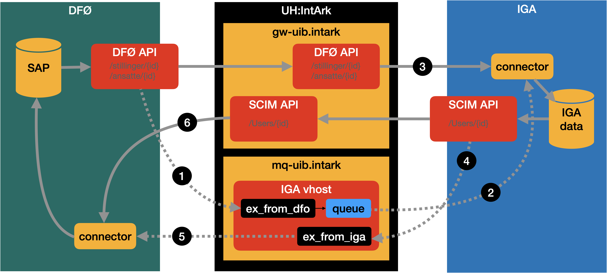

# IGA behaviour in BOTT DFØ integration test

This document describes the expected behaviour of the IGA in order to successfully complete
the first BOTT DFØ integration test scheduled for mid September 2020.

In the description below we assume the IGA store people, affiliations, and account objects.

The account objects will be connected to a person and store the allocated username.
Email-address and Feide-id can be derived from the username.

The IGA can start out with an empty database and only store people and affiliations as
events are received from DFØ.

## Infrastructure

Messages will be delivered to the IntArk Rabbit MQ vhost provided by the
university, at the `ex_from_dfo` exchange. Messages emitted should be delivered
to the `ex_from_iga` exchange in the same vhost.

The SCIM API will be exposed over the university's IntArk API gateway.

The DFØ API will be accessed from the university's IntArk API gateway.



The overall information flow we expect to demonstrate is:

1. Messages emitted from DFØ when something happens with employee or position objects
2. Messages received by IGA-connector (format described below)
3. IGA-connector fetches data as it reacts to messages (API documented at [api-dev.dfo.no](https://api-dev.dfo.no))
4. Messages emitted from IGA when account objects are created or updated (format described below)
5. Messages received by DFØ-connector
6. DFØ-connector fetches Feide-ID and e-mail address from IGA (API is subset of SCIM described below)

## Listen for messages from DFØ

There are two kind of messages to process from DFØ.

```
Topic: ansatte
{
  'firmakode': '9900',
  'gyldigEtter': '20200823',
  'id': '101926',
  'uri': 'dfo:ansatte'
}

Topic: stillinger
{
  'firmakode': '9900',
  'gyldigEtter': '20200823',
  'id': '30001233',
  'uri': 'dfo:stillinger'
}
```

These messages indicates that an employee or a position has changed.
An employee object in DFØ describes a person.
An position object in DFØ describes a job to be done within the organisation and which people
have this position in which time interval. Multiple people can have the same position at any
given time.

### Behaviour when receiving messages:

When the IGA receives the message about ansatt (employee in English):

* If we don't store a record for employee {id}, ignore the message
* otherwise request the resource `GET /dfo/ansatte/{id}`
* Compare response with the data we have stored. If anything has
  changed update and propagate change throughout the IGA.
* If the change involves any of the attributes exposed
  in SCIM emit update message.

When the IGA received the message about stilling (position in English):

* request the position resource `GET /dfo/stillinger/{id}`
* if we knew about this position before, compare with old
  to discover if any people have been removed.
* fetch all referenced employees we don't have a record on before;
  `GET /dfo/ansatte/{innehaverAnsattnr}` and store them.
* save enough about the position to be able to figure out when people are removed next time
  something happens with this position.
* Create/update affiliations based on the fetched position.
* Remove affiliations that are gone.

## Internal IGA events

An affiliations is removed:

* Treat it as if the _affiliation end date ended_.

An affiliation is created:

* Check if the start date has passed, if so treat it
as if the _affiliation start date started_.

An affiliation has been updated:

* Calculate if the person should have an account based on the
  set of active affiliations.
* If so and no user account exist create one (emit SCIM create message)
* If not and user has active account block the account (sets `active = false`) (emit SCIM update message)


Affiliation start date starts:

* Calculate if the person should have an account based on the
  set of active affiliations.
* If so and no user account exist create one (emit SCIM create message)

Affiliation end date ends:

* Calculate if the person should have an account based on the
  set of active affiliations.
* If not and no user account exist block the account (sets `active = false`) (emit SCIM update message)

The calculation referenced above can for now be simplified as "the person has at least one position with an date range that includes today). The only thing required for setting up an account is to generate a account UUID (id) and a random username (any algorithm will do).  No interaction with a real user required.

## SCIM interface

The accounts are exposed through the [SCIM interface](v01.md).

The data attributes required for the test are:

* `id`: uuid style id for the account.
* `userName`: generated by the IGA (any form will do for now)
* `active`: boolean status for the account
* `displayName`: Obtained from person as the concatenation of the first name and last name
* `emails.WORK`: Can use {userName}@uib.no for now
* `no:edu:scim:user.accountType`: Set to "primary"
* `no:edu:scim:user.employeeNumber`: Obtained from the {id} field in the ansatte object from DFØ
* `no:edu:scim:user.eduPersonPrincipalName`: aka feide-id. Can use {userName}@uib.no for now

This is an example of a valid `GET /Users/{id}` response:

```
{
    "schemas": [
        "urn:ietf:params:scim:schemas:core:2.0:User",
        "no:edu:scim:user"
    ],
    "id": "362ff2749bfb11eabbd5600308a4105a",
    "meta": {
        "resourceType": "User",
        "created": "2010-01-23T04:56:22Z",
        "lastModified": "2020-06-22T06:42:34Z"
    },
    "username": "gaa041@uib.no",
    "displayName": "Gisle Aas",
    "active": true,
    "emails": [
        {
            "value": "gaa041@uib.no",
            "type": "work"
        }
    ],
    "no:edu:scim:user": {
        "accountType": "primary",
        "employeeNumber":333355,
        "eduPersonPrincipalName": "gaa041@uib.no"
    }
}
```

The format for the messages to be emitted is described in the [README](README.md). It basically looks like this:

```
{
  "schemas: ["urn:ietf:params:scim:schemas:notify:2.0:Event"],
  "resourceUris": [
     "https://gw-uib.intark.uh-it.no/iga/scim/v2/Users/362ff2749bfb11eabbd5600308a4105a"
  ],
  "type":"MODIFY",
  "attributes": ["emails", "name.givenName", "no:edu:scim:user:userPrincipalName"],
}
```

Where "type" is "CREATE" when the account is created.  There is no "attributes" for the create event.
There must be a way to configure the prefix to use for the "resourceUri" since it should
based of the API GW path.

